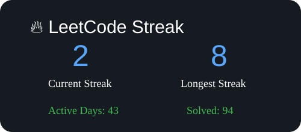

# 🚀 Data Structures & Algorithms Journey

<p align="center">
  A collection of my DSA learning journey following the <b>Apna College DSA Sheet</b>.
  <br>
  Includes problem-solving approaches, intuition, optimized solutions, and detailed notes.
</p>

<p align="center">


</p>

---

# 📌 About This Repository

This repository contains my preparation notes and solutions for:

- Data Structures
- Algorithms
- Problem-solving patterns
- Technical interview preparation

I am following the **Apna College DSA Placement Sheet** and documenting every problem with detailed notes.

For every problem, I maintain:

- ✅ Problem Statement
- ✅ Intuition
- ✅ Approach / Algorithm
- ✅ Code Implementation
- ✅ Dry Run
- ✅ Complexity Analysis
- ✅ Key Takeaways

---

# 📊 Coding Progress

<p align="center">
  
</p>
<p align="center">



</p>
<p align="center">
  
</p>


---

# 🔥 Recently Solved Problems

<!-- START_RECENT -->


| Date | Problem |
|---|---|
| 30 July 2026 | 125. Valid Palindrome |
| 28 July 2026 | 33. Search In Rotated Sorted Array |
| 28 July 2026 | 882. Peak Index In A Mountain Array |
| 28 July 2026 | 540. Single Element In A Sorted Array |
| 14 July 2026 | 3. Longest Substring Without Repeating Characters |
| 14 July 2026 | 287. Find The Duplicate Number |
| 13 July 2026 | 56. Merge Intervals |
| 12 July 2026 | 53. Maximum Subarray |
| 12 July 2026 | 50. Powx N |
| 12 July 2026 | 11. Container With Most Water |
| 12 July 2026 | 75. Sort Colors |
| 12 July 2026 | 15. 3Sum |
| 12 July 2026 | 18. 4Sum |
| 12 July 2026 | 74. Search A 2D Matrix |
| 11 July 2026 | 169. Majority Element |

<!-- END_RECENT -->

---

# 📚 DSA Repository Progress Tracker

<!-- START_PROGRESS -->


| Topic | Problems Uploaded | Progress |
|---|---:|---|
| Arrays | 13 | ██████░░░░ 68% |
| Heaps | 1 | ░░░░░░░░░░ 5% |
| Dp | 1 | ░░░░░░░░░░ 5% |
| Stack & Queue | 0 | ░░░░░░░░░░ 0% |
| Binary Search | 3 | █░░░░░░░░░ 15% |
| Strings | 1 | ░░░░░░░░░░ 5% |
| Trie | 0 | ░░░░░░░░░░ 0% |
| Recursion & Backtracking | 0 | ░░░░░░░░░░ 0% |
| Linked List | 0 | ░░░░░░░░░░ 0% |
| Graph | 0 | ░░░░░░░░░░ 0% |
| Binary Trees | 0 | ░░░░░░░░░░ 0% |
| Bst | 0 | ░░░░░░░░░░ 0% |
| Greedy | 0 | ░░░░░░░░░░ 0% |


### Repository Progress

**19 Problems Uploaded**


<!-- END_PROGRESS -->

---

# 🧠 Problem Solving Patterns

<!-- START_PATTERNS -->


| Pattern | Problems |
|---|---|
| Arrays | 136, 169 |
| Two Pointer | 18, 11, 15 |
| Binary Search | 74, 33 |
| Strings | 125 |

<!-- END_PATTERNS -->

# 🛣️ DSA Roadmap

```

Arrays
↓
Strings
↓
Searching & Sorting
↓
Recursion & Backtracking
↓
Linked List
↓
Stack & Queue
↓
Trees
↓
Binary Search Tree
↓
Heaps
↓
Graphs
↓
Dynamic Programming

```

---

# 📂 Repository Structure

```

DSA-Notes/

│
├── 33-search-in-rotated-sorted-array/
│   ├── README.md
│   └── solution.py
│
├── 540-single-element-in-a-sorted-array/
│   ├── README.md
│   └── solution.py
│
├── 852-peak-index-in-a-mountain-array/
│   ├── README.md
│   └── solution.py
│
├── scripts/
│   ├── update_progress.py
│   └── update_recent.py
│
├── data/
│   └── dsa_progress.json
│
└── README.md

```

---

# 🛠 Tools Used

<p align="center">


</p>

---

# 🎯 Goals

- Complete the Apna College DSA Placement Sheet
- Master important problem-solving patterns
- Improve algorithmic thinking
- Build strong technical interview preparation
- Maintain a structured DSA knowledge base

---

⭐ Keep Learning. Keep Solving. Keep Improving.

