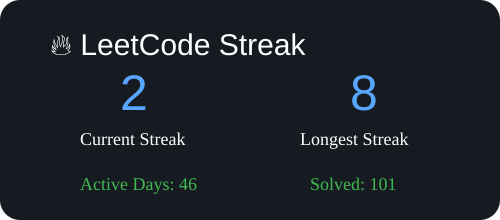

# 🚀 Data Structures & Algorithms Journey

<p align="center">
  A collection of my DSA learning journey following the <b>Apna College DSA Sheet</b>.
  <br>
  Includes problem-solving approaches, intuition, optimized solutions, and detailed notes.
</p>

<p align="center">


</p>

---

# 📌 About This Repository

This repository contains my preparation notes and solutions for:

- Data Structures
- Algorithms
- Problem-solving patterns
- Technical interview preparation

I am following the **Apna College DSA Placement Sheet** and documenting every problem with detailed notes.

For every problem, I maintain:

- ✅ Problem Statement
- ✅ Intuition
- ✅ Approach / Algorithm
- ✅ Code Implementation
- ✅ Dry Run
- ✅ Complexity Analysis
- ✅ Key Takeaways

---

# 📊 Coding Progress

<p align="center">
  
</p>
<p align="center">



</p>
<p align="center">
  
</p>


---

# 🔥 Recently Solved Problems

<!-- START_RECENT -->


| Date | Problem |
|---|---|
| 04 October 2026 | 1706. Min Cost To Connect All Points |
| 01 October 2026 | 310. Minimum Height Trees |
| 28 September 2026 | 684. Redundant Connection |
| 28 September 2026 | 1663. Detect Cycles In 2D Grid |
| 27 September 2026 | 733. Flood Fill |
| 27 September 2026 | 2755. Extra Characters In A String |
| 27 September 2026 | 133. Clone Graph |
| 25 September 2026 | 14. Longest Common Prefix |
| 25 September 2026 | 378. Kth Smallest Element In A Sorted Matrix |
| 25 September 2026 | 139. Word Break |
| 25 September 2026 | 208. Implement Trie Prefix Tree |
| 23 September 2026 | 347. Top K Frequent Elements |
| 21 September 2026 | 88. Merge Sorted Array |
| 21 September 2026 | 450. Delete Node In A Bst |
| 20 September 2026 | 173. Binary Search Tree Iterator |

<!-- END_RECENT -->

---

# 📚 DSA Repository Progress Tracker

<!-- START_PROGRESS -->


| Topic | Problems Uploaded | Progress |
|---|---:|---|
| Arrays | 13 | █░░░░░░░░░ 15% |
| Heaps | 3 | ░░░░░░░░░░ 3% |
| Dp | 1 | ░░░░░░░░░░ 1% |
| Stack & Queue | 8 | ░░░░░░░░░░ 9% |
| Binary Search | 3 | ░░░░░░░░░░ 3% |
| Strings | 7 | ░░░░░░░░░░ 8% |
| Trie | 3 | ░░░░░░░░░░ 3% |
| Recursion & Backtracking | 4 | ░░░░░░░░░░ 4% |
| Linked List | 10 | █░░░░░░░░░ 11% |
| Graph | 7 | ░░░░░░░░░░ 8% |
| Binary Trees | 16 | █░░░░░░░░░ 19% |
| Bst | 9 | █░░░░░░░░░ 10% |
| Greedy | 0 | ░░░░░░░░░░ 0% |


### Repository Progress

**84 Problems Uploaded**


<!-- END_PROGRESS -->

---

# 🧠 Problem Solving Patterns

<!-- START_PATTERNS -->


| Pattern | Problems |
|---|---|
| Stack & Queue | 503, 2195, 496 |
| Two Pointer | 15, 11, 18 |
| Backtracking | 90, 40, 567 |
| Binary Trees | 101, 572 |
| Strings | 242, 443, 125, 49 |
| Binary Search | 33, 74 |
| Arrays | 169, 136 |
| Trie | 14 |

<!-- END_PATTERNS -->

# 🛣️ DSA Roadmap

```

Arrays
↓
Strings
↓
Searching & Sorting
↓
Recursion & Backtracking
↓
Linked List
↓
Stack & Queue
↓
Trees
↓
Binary Search Tree
↓
Heaps
↓
Graphs
↓
Dynamic Programming

```

---

# 📂 Repository Structure

```

DSA-Notes/

│
├── 33-search-in-rotated-sorted-array/
│   ├── README.md
│   └── solution.py
│
├── 540-single-element-in-a-sorted-array/
│   ├── README.md
│   └── solution.py
│
├── 852-peak-index-in-a-mountain-array/
│   ├── README.md
│   └── solution.py
│
├── scripts/
│   ├── update_progress.py
│   └── update_recent.py
│
├── data/
│   └── dsa_progress.json
│
└── README.md

```

---

# 🛠 Tools Used

<p align="center">


</p>

---

# 🎯 Goals

- Complete the Apna College DSA Placement Sheet
- Master important problem-solving patterns
- Improve algorithmic thinking
- Build strong technical interview preparation
- Maintain a structured DSA knowledge base

---

⭐ Keep Learning. Keep Solving. Keep Improving.

